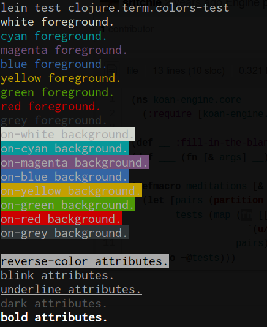
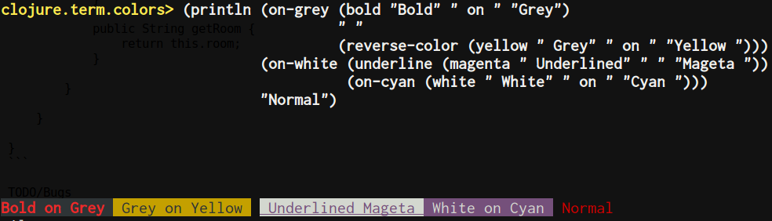

# clojure-term-colors

A Clojure library for ASCII terminal color output, based on python
termcolor package



## Usage

__Leiningen ([via Clojars](https://clojars.org/clojure-term-colors))__

```
[clojure-term-colors "0.1.0-SNAPSHOT"]
```



_You can also set the `*disable-colors*` flag variable (using binding) if you want
to disable colors temporarily._

## Available Functions

```
white, cyan, magenta, blue, yellow, green, red, grey, on-white,
on-cyan, on-magenta, on-blue, on-yellow, on-green, on-red, on-grey,
concealed, reverse-color, blink, underline, dark, bold
```

## License

Copyright © 2014 Thura Hlaing

Distributed under the Eclipse Public License either version 1.0 or (at
your option) any later version.
